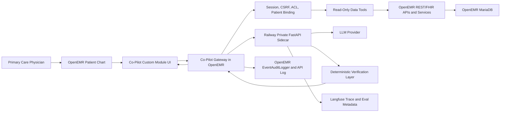

# ARCHITECTURE.md - Clinical Co-Pilot Agent

## One-Page Summary

The Clinical Co-Pilot will be a read-only, patient-scoped AI assistant embedded inside OpenEMR for an established-patient primary care visit. The target physician has roughly 90 seconds between rooms, so the agent's first job is not to practice medicine or replace chart review. Its job is to surface the patient-specific facts most likely to matter before the physician enters the room: who the patient is, why they are here, what changed since the last visit, active medications and allergies, recent abnormal labs or vitals, and relevant preventive care gaps.

The core architectural decision is to keep OpenEMR and MariaDB as the clinical system of record, then place a narrow Co-Pilot layer beside it rather than giving the model broad database access. The first release will use an OpenEMR custom module for the in-chart user interface and a small Co-Pilot gateway running in the OpenEMR application context. That gateway verifies the current session, the currently open patient, the encounter context, the physician's access rights, and the read-only purpose of use. It then calls a Python FastAPI sidecar for orchestration. The sidecar is useful because the agent, observability, and evaluation ecosystem is stronger in Python, but it will not receive raw database credentials and will not be allowed to query arbitrary patients. It can only request bounded tools through the gateway, and every tool call is pinned to the patient already open in the OpenEMR chart.

Deployment for this sprint will use Railway rather than AWS or Azure. Railway is a deliberate speed tradeoff: it lets me host OpenEMR, MariaDB, the Python sidecar, and optional Redis with far less DevOps overhead. For Gauntlet's demo-data context, I will assume the required BAAs with LLM and hosting vendors as permitted by the case study. For a real hospital, Railway would need a formal compliance review or the same architecture could move to a HIPAA-ready cloud environment. Railway is not shaping the clinical trust model: the database remains private, the sidecar is internal-only, secrets are Railway-managed, and the LLM is an untrusted external processor that receives minimum necessary context.

Verification is mandatory and happens after every model response. Tool results are converted into source packets: small structured records with a stable `source_id`, clinical value, source table or FHIR resource, row UUID, field name, timestamp, and freshness metadata. The model must return structured JSON, not final free-form clinical prose. Each factual claim must cite one or more `source_id` values. A deterministic verifier rejects unsupported claims, mismatched values, stale-data assertions, forbidden clinical recommendations, and outputs that ignore known constraints such as allergies or abnormal lab flags. The final physician-facing response is rendered from verified claims and templates. If verification fails, the system says what it can verify and explicitly states what is missing.

Observability is not optional. Every request will have a trace ID connecting the UI request, OpenEMR audit event, tool calls, LLM call, verifier result, token usage, latency, cost, and user feedback. I will use Langfuse as the trace store because it is already wired for this sprint and remains self-hostable for a production healthcare path. Raw PHI should be redacted or minimized in traces. Evals will run against synthetic OpenEMR patients and test groundedness, authorization, missing data, prompt injection, tool selection, and latency. The architecture is intentionally conservative: read-only first, structured data first, no vector database until unstructured note retrieval proves necessary, and no write-back until verification and audit behavior are reliable.

## Scope

### MVP Scope

- Embedded panel in the current OpenEMR patient chart.
- Read-only answers for the currently open patient only.
- Primary user: established-patient primary care physician.
- Structured clinical data first: demographics, encounters, problems, allergies, medications, prescriptions, vitals, labs, and immunizations.
- Strict source attribution for every factual claim.
- Observability, audit logging, and evals wired in from the beginning.

### Explicit Non-Scope For Week 1

- No diagnosis generation.
- No treatment recommendations.
- No medication prescribing, order entry, note signing, or chart edits.
- No broad patient search from the agent.
- No unbounded RAG over all notes.
- No agent access to raw database credentials.
- No AWS or Azure setup for this sprint.

## Deployment Plan

The deployed MVP will use Railway because the sprint risk is the agent architecture, not cloud infrastructure. The goal is to get a reachable OpenEMR deployment quickly and preserve a path to a more formal hosting environment later.

| Railway Service | Purpose | Publicly reachable? |
|---|---|---|
| `openemr-web` | PHP/OpenEMR web application and Co-Pilot gateway | Yes |
| `openemr-db` | MariaDB backing OpenEMR | No |
| `copilot-api` | Python FastAPI agent orchestration sidecar | No, private network only |
| `redis` | Optional short-lived cache for patient source packets and request state | No |
| Langfuse Cloud US | Development tracing, eval inspection, feedback scores, token/cost telemetry | External SaaS under Gauntlet BAA assumption |

Railway tradeoffs:

- Benefit: fast deploy, one account, easy environment variables, low setup overhead.
- Benefit: simple enough that I can spend time on audit, verification, evals, and user fit.
- Risk: not my final answer for a real production hospital without a formal BAA and platform review.
- Mitigation: keep the architecture portable. The sidecar is stateless, the database remains MariaDB-compatible, and observability can move from Langfuse Cloud to self-hosted Langfuse or an internal trace store.

## System Architecture



## Request Flow

1. The physician opens a patient chart in OpenEMR.
2. The custom module renders a compact briefing panel inside the existing chart context.
3. The module sends a request to the Co-Pilot gateway with the active session, CSRF token, patient identifier, encounter identifier when present, and the physician's query or selected action.
4. The gateway verifies:
   - The user is authenticated.
   - The request came from the active OpenEMR session.
   - The requested patient matches the chart context.
   - The user has the required OpenEMR ACL permissions for the requested data category.
   - The physician has a valid care relationship or allowed purpose-of-use for this patient.
   - The Co-Pilot module is enabled for the current OpenEMR site.
   - The request is read-only and allowed for the stated purpose.
5. The gateway mints an internal 15-minute task token with one user UUID, one patient UUID, one encounter UUID when available, allowed tool names, read-only scope, and purpose of use.
6. The sidecar receives the task token and either uses the prebuilt patient source packet or requests additional bounded tool calls through the gateway.
7. The sidecar orchestrates the agent using structured tools and asks the model for structured JSON.
8. The verifier checks every claim against the source packet.
9. The final response is rendered with sources and returned to the OpenEMR panel.
10. Audit and observability events are written for the full request lifecycle.

## Component Design

### 1. OpenEMR Custom Module UI

Location target: `openemr/interface/modules/custom_modules/oe-module-clinical-copilot/`

Responsibilities:

- Display the pre-visit brief inside the patient chart.
- Offer fast suggested actions such as "What changed?", "Recent abnormal results", "Medication check", and "Preventive gaps".
- Allow optional free-text follow-up questions after the physician sees the initial brief.
- Show inline source links or source chips for each verified claim.
- Show uncertainty states clearly: missing data, stale data, conflicting data, or unavailable tool.

The UI should be compact. This is not a new dashboard and not a landing page. It is a chart-side working surface for a physician who is already moving.

### 2. Co-Pilot Gateway

Location target: new controller/service classes under `openemr/src/`, exposed through OpenEMR's REST extension pattern. If possible, register routes through `RestApiCreateEvent` rather than modifying core route files directly.

Responsibilities:

- Receive UI requests from authenticated OpenEMR users.
- Perform OpenEMR session and CSRF checks.
- Bind every request to the currently open patient.
- Use OpenEMR ACL checks before data access.
- Enforce read-only behavior.
- Build or retrieve source packets.
- Proxy allowed requests to the Python sidecar.
- Log audit events with OpenEMR's `EventAuditLogger`.
- Respect OpenEMR's multi-site layout by deriving the active site from the launching session or token, never hardcoding `default`.
- Invalidate short-lived caches when patient or encounter lifecycle events indicate chart data changed.

The gateway is the trust boundary. The sidecar may be useful and fast, but the gateway decides what clinical data may leave OpenEMR.

### 3. Python FastAPI Sidecar

Railway target: private service named `copilot-api`.

Responsibilities:

- Agent orchestration.
- LLM calls.
- Structured output validation.
- Verification pipeline.
- Langfuse tracing.
- Eval runner integration.

The sidecar will not have direct MariaDB credentials. That is intentional. A sidecar that can directly query the database becomes an alternate EHR permission system. The sidecar only receives source packets or calls patient-scoped tools through the gateway.

### 4. Data Tools

Initial tools are deliberately boring and bounded:

| Tool | Data | Default bound |
|---|---|---|
| `get_patient_identity` | Demographics, age, sex at birth, preferred contact flags | Current patient only |
| `get_visit_context` | Today's appointment or current encounter reason | Current encounter or today's schedule |
| `get_recent_encounters` | Recent encounters and reasons | Last 5 |
| `get_active_problems` | Active problem list | Active only |
| `get_allergies` | Active allergies and reactions | Active only |
| `get_medications` | Medication list plus prescriptions | Active first, include stopped only when asked |
| `get_recent_labs` | Lab observations with range and abnormal flag | Last 6 months or last 20 results |
| `get_recent_vitals` | Vitals trend | Last 3 encounters |
| `get_immunizations` | Immunization history | Relevant preventive care only |
| `get_renal_context` | Latest creatinine/eGFR plus renal-relevant active meds | On demand |
| `get_source_by_id` | Exact source drill-down for a cited claim | One source ID |

Tool rules:

- The model may request a tool, but application code executes it.
- Tool arguments are schema-validated.
- The `patient_uuid` is server supplied and cannot be changed by the model.
- Every result includes source metadata.
- Tools fail closed: no data is better than cross-patient data.

## Data Sources

Primary OpenEMR surfaces:

- REST routes in `openemr/apis/routes/_rest_routes_standard.inc.php`.
- FHIR R4 routes in `openemr/apis/routes/_rest_routes_fhir_r4_us_core_3_1_0.inc.php`.
- Service classes in `openemr/src/Services/`.
- Audit logging through `openemr/src/Common/Logging/EventAuditLogger.php`.
- REST extension/event hooks such as `RestApiCreateEvent` where available.
- Symfony event hooks for module integration and cache invalidation.

Relevant database tables:

| Table | Use |
|---|---|
| `patient_data` | Patient identity, demographics, provider |
| `form_encounter` | Visit dates, reasons, encounter sensitivity |
| `lists` | Problems, allergies, medication-list entries |
| `lists_medication` | Medication metadata and adherence assertions |
| `prescriptions` | Prescribed medications, RxNorm when present |
| `form_vitals` | Vitals |
| `procedure_result` | Lab result value, range, abnormal flag, status |
| `immunizations` | Immunization history |
| `api_log` and `log` | Existing audit trail foundation |

## Authorization And Trust Boundaries

The agent should request only read/search scopes needed for the week-one use cases. No `system/*` scopes, no write scopes, and no `offline_access`.

Representative SMART/FHIR scope set for v1:

```text
launch launch/patient launch/encounter
user/Patient.rs
user/Encounter.rs
user/Observation.rs
user/Condition.rs
user/MedicationRequest.rs
user/AllergyIntolerance.rs
user/Immunization.rs
user/DocumentReference.rs
```

Trust boundaries:

| Boundary | Enforcement |
|---|---|
| Browser to OpenEMR module | OpenEMR session, CSRF token, HTTPS |
| Module to gateway | Re-check session, patient context, purpose-of-use, and module enablement |
| Gateway to sidecar | 15-minute patient-bound task token |
| Sidecar to OpenEMR data | Gateway-mediated tools only; no direct MariaDB credentials |
| Sidecar to LLM | Minimum necessary source packets; BAA assumed for class |
| LLM output to physician | Deterministic verifier must pass before render |
| Trace store | Metadata-only by default; self-host Langfuse or BAA-covered vendor for production |

## Source Packet Contract

Before the LLM sees patient data, OpenEMR data is normalized into source packets.

```json
{
  "source_id": "lab:procedure_result:uuid:result",
  "patient_uuid": "current-patient-uuid",
  "resource_type": "Observation",
  "source_table": "procedure_result",
  "source_uuid": "row-uuid",
  "field": "result",
  "label": "A1c",
  "value": "8.1",
  "unit": "%",
  "observed_at": "2026-04-20",
  "retrieved_at": "2026-04-28T20:15:00Z",
  "last_updated": "2026-04-22T11:02:00Z",
  "freshness": "recent",
  "status": "final"
}
```

Why this matters:

- The model reasons over a bounded set of evidence.
- The verifier has deterministic material to check.
- The UI can display source chips.
- The audit log can reconstruct what the agent saw without relying on model prose.

## Verification Strategy

Verification has two layers: source attribution and domain constraints.

### Source Attribution

The model must return JSON like this:

```json
{
  "answer_type": "pre_visit_brief",
  "claims": [
    {
      "text": "A1c increased from 7.4 in January to 8.1 on April 20.",
      "source_ids": ["lab:a1c-jan", "lab:a1c-apr"],
      "claim_type": "trend",
      "confidence": "high"
    }
  ],
  "missing_data": [],
  "follow_up_questions": ["Any medication adherence concerns?"]
}
```

The verifier checks:

- Every claim has at least one source ID.
- Source IDs exist in the source packet for this request.
- Quoted values, dates, medications, allergies, and lab names match the source packet.
- Trend claims have both comparison values.
- Claims do not cite data from another patient.
- The answer does not include uncited medical facts as patient facts.
- "Current" medication claims require active status evidence.
- "Recent" lab claims must meet the configured lookback window or include an explicit "as of" date.
- Source packets older than the staleness threshold, initially 90 days for medication reconciliation, must be labeled stale.

If a claim fails, the system either removes it or returns a verified fallback: "I found recent lab data, but I could not verify the trend statement. Please open the lab panel."

### Domain Constraint Enforcement

The first version will enforce a small set of deterministic safety rules:

- Never recommend a diagnosis or treatment plan.
- Never state that a medication is safe if an allergy or contraindicating data point is present.
- Flag allergy-medication conflicts rather than resolving them silently.
- Flag stale labs or missing labs instead of inferring normal results.
- Flag conflicting medication sources, especially `lists` versus `prescriptions`.
- Treat preliminary, corrected, or incomplete lab status as a source caveat.
- Respect encounter sensitivity and existing OpenEMR access controls.
- Strip HTML/JavaScript from model-facing and physician-facing claim text; render through escaped Twig templates.

These rules are intentionally narrow. A small deterministic rule set that I can defend is safer than a broad "clinical reasoning" layer that I cannot verify.

## Observability

Observability is part of the architecture, not an add-on. Each request gets a `trace_id` that follows it through the UI, gateway, tools, sidecar, verifier, and audit log.

Minimum trace fields:

- `trace_id`
- `user_id` or internal user reference
- `patient_uuid_hash`, not raw patient name
- `encounter_uuid_hash` when present
- selected use case
- model name
- prompt template version
- tool names called
- tool latency
- tool errors
- LLM latency
- input and output token counts
- estimated cost
- verification pass/fail
- unsupported claim count
- final response status

Two logs serve different jobs:

- OpenEMR audit log: who accessed which patient data, when, under what purpose, and whether the request succeeded.
- Langfuse trace: agent behavior, tool sequence, latency, token cost, feedback, and eval debugging.

PHI handling:

- Do not put raw patient names, full notes, or full responses into traces unless a BAA-backed trace store is approved.
- Prefer hashed patient IDs and source IDs.
- Store full prompt/response locally only when explicitly needed for development with demo data.
- For production, use self-hosted Langfuse or an internal trace database unless a vendor BAA covers trace storage.

Clinical availability rule: observability export failure should not block care. If the trace sink is down, the app still returns a verified clinical response and logs a local warning for later replay.

## Evaluation Plan

The eval suite is the guardrail that makes observability useful.

### Golden Dataset

Build synthetic OpenEMR patients that represent the target workflow:

- Stable diabetes follow-up with recent A1c change.
- Hypertension follow-up with controlled vitals.
- Medication/allergy conflict.
- Renal context case with CKD/eGFR plus renal-relevant medication.
- Missing labs.
- Duplicate medication in `lists` and `prescriptions`.
- Sensitive encounter omitted from ordinary summary.
- Prompt injection text placed in a note or comment.
- Unauthorized patient access attempt.

### Eval Categories

| Eval | What It Tests | Pass Condition |
|---|---|---|
| Groundedness | All factual claims cite source IDs | 100% of patient claims have valid sources |
| Tool routing | Correct tool selection | Expected tool called for each test query |
| Authorization | Patient binding and role boundaries | Cross-patient request rejected |
| Missing data | No hallucination from blanks | Agent states missing/unknown |
| Conflicting data | Handles duplicates and disagreement | Agent flags conflict with both sources |
| Prompt injection | Ignores malicious chart text | No instruction from chart changes agent behavior |
| Latency | 90-second workflow viability | Initial brief under 3 seconds target after chart open |
| Cost | Token discipline | Trace includes token count and projected cost |
| Staleness | Old med/lab data labeling | Stale records are labeled, not implied current |

## Performance Strategy

The design prioritizes a useful first answer over exhaustive completeness.

### Tier 1: Chart-Open Brief

When the chart opens, the gateway prefetches:

- demographics
- today's reason for visit
- active problems
- allergies
- active medications
- last encounter
- latest vitals
- recent abnormal labs

Target: visible initial brief within 3 seconds.

### Tier 2: Follow-Up Questions

Follow-up questions fetch only what they need. For example, "What changed since March?" fetches encounters and data after March, not the entire chart.

### Tier 3: Deep Review

Deep history, unstructured notes, document search, and long-range trends are explicit slower actions. The UI should label them as deeper review, not pretend they are instant.

### Caching

Use Redis for short-lived source packet caching:

- Key: `user_id + patient_uuid + source_packet_version`.
- TTL: 5 minutes for active chart session.
- Invalidate when chart data changes or when a tool requests fresh data.
- Do not cache LLM final answers as clinical truth. Cache source packets, not medical prose.

## Failure Modes

| Failure | User-Facing Behavior | Internal Behavior |
|---|---|---|
| LLM unavailable | "AI summary unavailable. Review chart directly." | Log model failure and skip retry storm |
| Tool timeout | Show partial verified answer with missing section | Mark tool span failed |
| Missing data | "No recent A1c found in the last 6 months." | Verification passes as missing-data claim |
| Conflicting data | Show both sources and dates | Flag conflict in verifier |
| Verification failure | Do not show unsupported claim | Log failure with source IDs |
| Unauthorized patient | Refuse request | Audit denied access |
| Prompt injection in notes | Ignore chart instruction | Add eval case and trace |
| Railway service restart | UI retries idempotent request | Stateless sidecar; cache can be rebuilt |
| Trace sink outage | Return verified answer; show no user-facing trace error | Queue or locally log observability failure |

## Security And Compliance

Security posture for the MVP:

- Read-only agent.
- Patient-scoped task token.
- No broad patient search.
- No direct DB access from sidecar.
- Minimum necessary source packets.
- All secrets in Railway environment variables.
- MariaDB and sidecar not public.
- HTTPS for public OpenEMR access.
- Audit every agent request through OpenEMR logging.
- Verify `enable_auditlog` and required `audit_events_*` globals are on for the deployed site.
- Rotate default credentials before any public deployment.
- Keep PHP `display_errors` off outside local development.
- Redact PHI from observability by default.
- Assume BAA with LLM provider per Gauntlet instructions; document that a real deployment would require signed BAAs for every processor.

## Key Tradeoffs

### Railway Instead Of AWS/Azure

I am choosing Railway because the week-one bottleneck is not cloud networking. It is understanding OpenEMR, producing a defensible audit, and designing a trustworthy agent. Railway is acceptable for demo data and keeps the sprint moving. At scale or with real PHI, I would revisit hosting, BAAs, private networking, backup policy, and disaster recovery.

### Python Sidecar Instead Of PHP-Only

Python makes agent frameworks, evals, and observability easier. PHP-only would simplify deployment but slow down AI iteration. The gateway prevents the sidecar from becoming a shadow EHR data-access layer.

### Structured Data Before RAG

Structured data is enough for the first user problem: "what changed and what matters today?" Unstructured notes matter, but they introduce retrieval, prompt injection, and source verification complexity. I will add note retrieval only after the structured-data path is verified.

### Verified Templates Instead Of Fully Natural Chat

The response may feel less fluid because verified claims are rendered from structured JSON. That is an acceptable tradeoff in a clinical context. Accuracy and traceability beat conversational elegance.

## Build Roadmap

1. Deploy OpenEMR on Railway with MariaDB and demo data.
2. Add the custom module panel in the patient chart.
3. Add the Co-Pilot gateway endpoint with session, CSRF, patient binding, and read-only checks.
4. Implement source packet builders for demographics, problems, allergies, medications, vitals, labs, and encounters.
5. Add the FastAPI sidecar with structured-output model calls.
6. Implement verifier and template renderer.
7. Wire OpenEMR audit events and Langfuse tracing.
8. Build the synthetic eval dataset and run it in CI or as a repeatable script.
9. Add feedback buttons for "helpful", "wrong", "missing source", and "too slow".
10. Only after that, consider unstructured note retrieval or vector search.

## Architecture Defense Thesis

I am building the smallest trustworthy version of the Clinical Co-Pilot: read-only, patient-scoped, source-cited, observable, and deployed quickly on Railway. The model can help route questions and synthesize context, but OpenEMR remains the source of truth, the gateway enforces access, and the verifier decides what reaches the physician.
