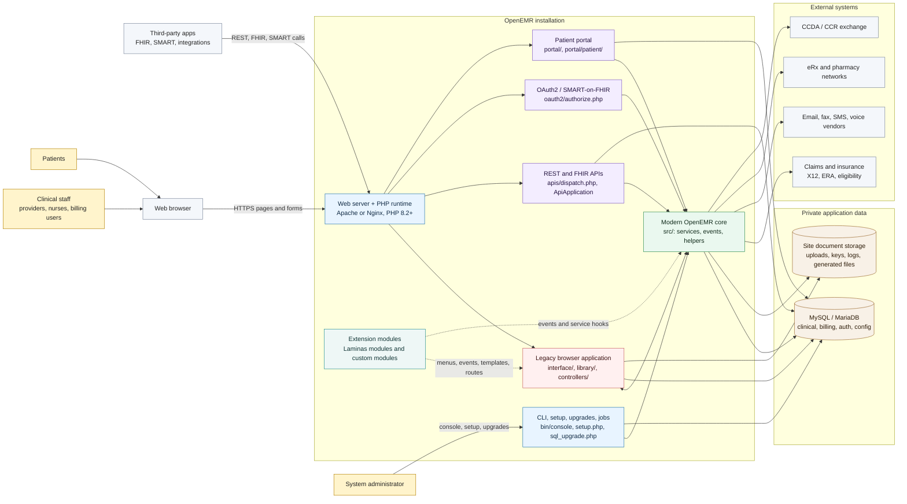
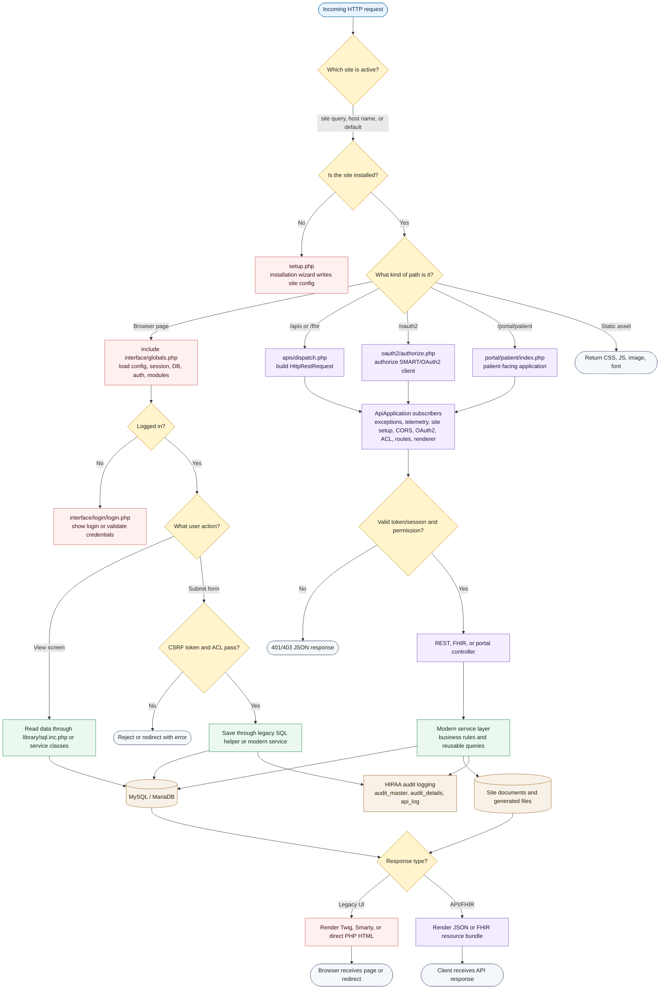
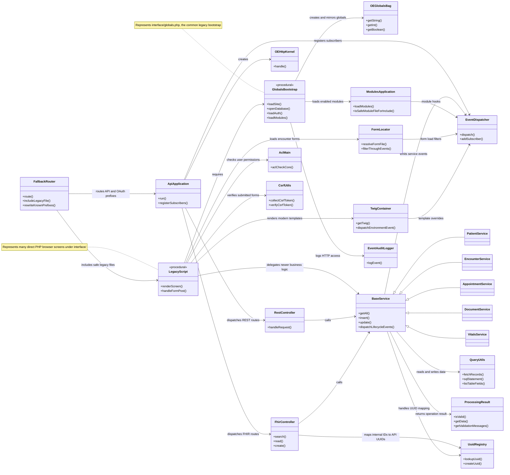
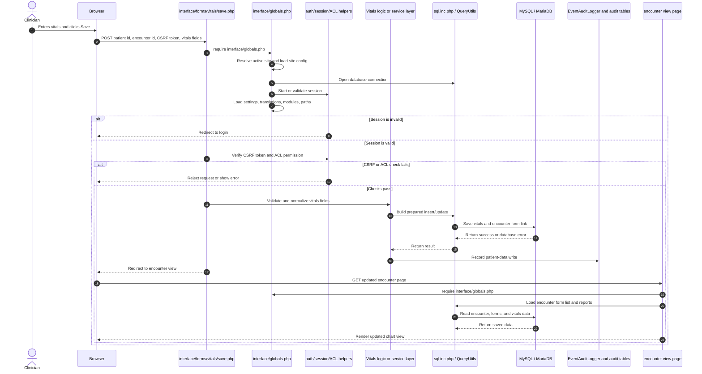

# OpenEMR Visual Architecture Guide

Audience: a novice software engineer who needs to understand the OpenEMR codebase before reading individual files.

OpenEMR is a self-hosted Electronic Medical Record and Practice Management system. The most useful beginner mental model is this:

- `interface/`, `library/`, and `controllers/` are the older direct-PHP web application.
- `src/` is the newer namespaced PHP application code where most reusable services live.
- `apis/`, `oauth2/`, and `portal/` are specialized entrypoints for APIs, SMART-on-FHIR authorization, and the patient portal.
- `sites/<site_id>/` and the database hold the private, per-installation data.

The diagrams below intentionally simplify the full codebase. They show the parts a new engineer needs to recognize quickly before diving into implementation details.

## 1. High-Level System Architecture Overview

This C4-style context and container view shows who uses OpenEMR, which major runtime containers exist inside one OpenEMR installation, and where data or external integrations sit.

## 2. Component / Module Breakdown

This view zooms inside the codebase. It groups folders by responsibility and shows how entrypoints, legacy pages, APIs, services, modules, and data access connect.

```mermaid
%% Diagram 2: Internal component and module breakdown.
%% Folder names are included so a beginner can connect the diagram to the repo tree.
flowchart TB
    classDef entry fill:#e8f4ff,stroke:#2374ab,color:#102a43;
    classDef legacy fill:#fff0f0,stroke:#c75c5c,color:#3a1111;
    classDef modern fill:#eaf8ef,stroke:#2c8a4b,color:#102a1a;
    classDef api fill:#f3edff,stroke:#7e57c2,color:#23133f;
    classDef data fill:#f8f1e7,stroke:#9b6a2f,color:#2d1c08;
    classDef module fill:#eef7f6,stroke:#248f8f,color:#0f3333;
    classDef ui fill:#f4f7fb,stroke:#7a869a,color:#222;

    subgraph entrypoints["Entrypoints: first files a request or command reaches"]
        direction LR
        root["index.php<br/>chooses site, redirects to login or setup"]:::entry
        publicIndex["public/index.php<br/>modern front controller"]:::entry
        apiDispatch["apis/dispatch.php<br/>REST and FHIR entry"]:::api
        oauthEntry["oauth2/authorize.php<br/>OAuth2 and SMART entry"]:::api
        controllerPhp["controller.php<br/>legacy Smarty controller router"]:::legacy
        console["bin/console<br/>CLI commands and jobs"]:::entry
        setup["setup.php, sql_upgrade.php<br/>install and database upgrade flows"]:::entry
    end

    subgraph legacyUi["Legacy browser UI: most screens users click through"]
        direction TB
        globals["interface/globals.php<br/>site, session, database, auth, globals, modules"]:::legacy
        login["interface/login/<br/>login and language/facility selection"]:::legacy
        mainTabs["interface/main/tabs/<br/>main frame, tabs, menus"]:::legacy
        patientFile["interface/patient_file/<br/>patient chart, encounters, reports"]:::legacy
        forms["interface/forms/<br/>encounter forms such as vitals and fee sheet"]:::legacy
        billingReports["interface/billing/, interface/reports/<br/>billing, claims, reports"]:::legacy
        library["library/*.inc.php<br/>shared procedural helpers"]:::legacy
        smartyControllers["controllers/C_*.class.php<br/>older document, pharmacy, prescription controllers"]:::legacy
    end

    subgraph apiLayer["API and interoperability layer"]
        direction TB
        routeMaps["apis/routes/*.inc.php<br/>standard REST, FHIR R4, portal routes"]:::api
        apiApp["src/RestControllers/ApiApplication.php<br/>Symfony kernel + subscribers"]:::api
        restControllers["src/RestControllers/<br/>standard API controllers"]:::api
        fhirControllers["src/RestControllers/FHIR/<br/>FHIR resource controllers"]:::api
        smart["src/FHIR/SMART and OpenID Connect<br/>SMART scopes, tokens, OAuth2"]:::api
    end

    subgraph modernCore["Modern namespaced core: reusable application code"]
        direction TB
        core["src/Core/<br/>Kernel, modules, globals bag, headers"]:::modern
        common["src/Common/<br/>DB, auth, ACL, session, CSRF, logging, Twig, UUIDs"]:::modern
        services["src/Services/<br/>Patient, Encounter, Appointment, Document, Billing services"]:::modern
        domain["src/Billing, src/FHIR, src/Cqm, src/Reports, src/Menu<br/>domain-specific packages"]:::modern
        templates["templates/, public/assets, public/themes<br/>Twig, Smarty, Bootstrap, JS, CSS"]:::ui
    end

    subgraph modules["Extension systems"]
        direction TB
        laminas["interface/modules/zend_modules/module/<br/>Laminas module family"]:::module
        customMods["interface/modules/custom_modules/<br/>event-driven custom modules"]:::module
        events["src/Events and Symfony EventDispatcher<br/>menus, forms, templates, services, API hooks"]:::module
    end

    subgraph dataLayer["Persistence and data access"]
        direction TB
        query["library/sql.inc.php and src/Common/Database/QueryUtils.php<br/>prepared SQL helpers"]:::data
        mysql[("MySQL / MariaDB<br/>about 280 core tables")]:::data
        siteDocs[("sites/{site_id}/<br/>sqlconf.php, config.php, documents, logs")]:::data
        schema["sql/database.sql and sql/*_upgrade.sql<br/>schema and versioned upgrades"]:::data
    end

    root --> login
    root --> setup
    publicIndex -->|"FallbackRouter"| apiDispatch
    publicIndex -->|"FallbackRouter"| oauthEntry
    publicIndex -->|"FallbackRouter: legacy files"| globals
    controllerPhp --> smartyControllers
    console --> globals
    setup --> schema

    login --> globals
    mainTabs --> globals
    patientFile --> globals
    forms --> globals
    billingReports --> globals
    globals --> library
    mainTabs --> templates
    patientFile --> templates
    forms --> templates
    billingReports --> templates
    smartyControllers --> templates

    apiDispatch --> routeMaps
    oauthEntry --> apiApp
    routeMaps --> apiApp
    apiApp --> restControllers
    apiApp --> fhirControllers
    apiApp --> smart

    restControllers --> services
    fhirControllers --> services
    fhirControllers --> domain
    patientFile --> services
    forms --> services
    billingReports --> services
    services --> common
    domain --> common
    core --> common

    laminas -.-> events
    customMods -.-> events
    events -.-> core
    events -.-> services
    events -.-> templates
    events -.-> mainTabs
    events -.-> forms

    library --> query
    common --> query
    services --> query
    query --> mysql
    schema --> mysql
    common --> siteDocs
    patientFile --> siteDocs
    forms --> siteDocs
    billingReports --> siteDocs
```

## 3. Data Flow and Key Processes

This flowchart shows how the two most common request families work: browser UI requests and API/FHIR requests. The same site configuration, authentication, services, database, and audit trail are reused in different ways.

## 4. Core Object Relationships

OpenEMR is not purely object-oriented. The older UI uses many procedural PHP scripts, while newer areas use classes and services. This diagram focuses on the main objects and helpers that connect those two worlds.

## 5. Sequence Diagram: Saving Encounter Vitals

This end-to-end sequence follows a clinician saving a common encounter form. It shows how a legacy page still relies on `interface/globals.php`, then uses security checks, data access, audit logging, and a redirect back to the encounter view.

## How To Read These Diagrams

Start with Diagram 1. It explains the big picture: people and external systems talk to one OpenEMR installation, and that installation stores private data in the database and site document folders.

Use color as a guide:

- Blue boxes are entrypoints or runtime infrastructure.
- Red boxes are legacy direct-PHP code. In this repo, that usually means `interface/`, `library/`, or `controllers/`.
- Green boxes are newer PHP classes under `src/`.
- Purple boxes are API, OAuth2, FHIR, SMART, or portal flows.
- Brown cylinders are persistent data: database tables, files, config, uploads, logs.
- Dotted arrows mean extension points, usually modules or event subscribers.

When you see a folder name inside a box, treat it as a starting point for reading the code. For example, if a diagram says `src/Services/PatientService.php`, that means reusable patient behavior is likely there. If it says `interface/patient_file/`, that means the browser screens for patient charts are likely there.

The most important beginner idea is that OpenEMR has two layers that cooperate. Older pages still power much of the product, but newer services, API controllers, event subscribers, and helper classes increasingly hold reusable logic.

## Additional Valuable Views To Create Later

1. Database domain ERD: group tables by patients, encounters, billing, scheduling, documents, users, ACL, FHIR/OAuth, and audit logging.
2. Security and permissions map: compare browser login, patient portal login, OAuth2/SMART tokens, ACL checks, CSRF checks, and audit logging.
3. Deployment/runtime topology: show Docker development, production web server/PHP runtime, MySQL/MariaDB, background jobs, file storage, backups, and optional external services.
