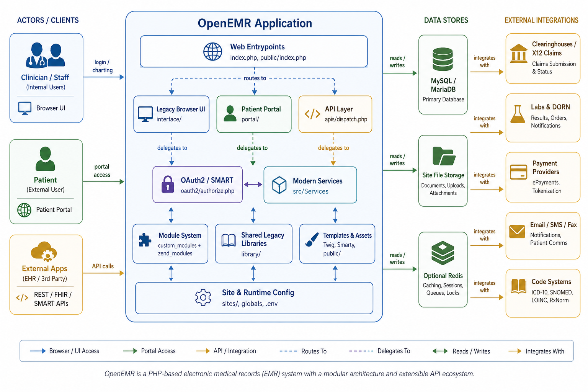
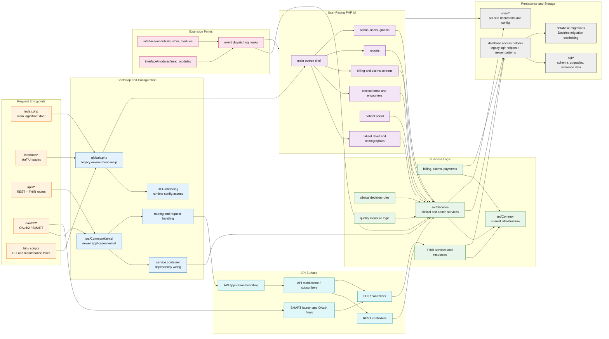
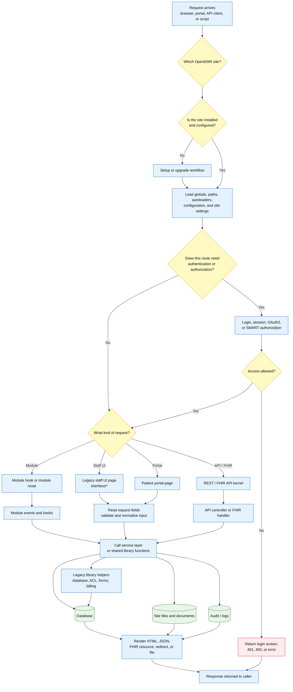
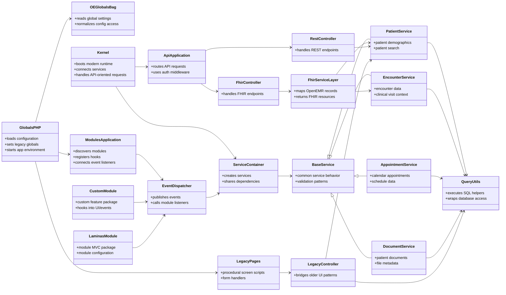
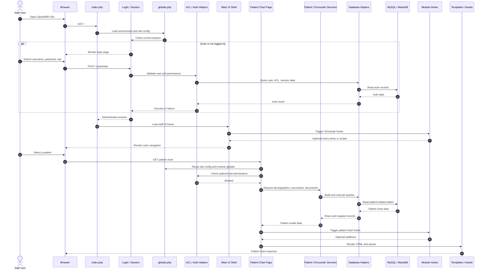
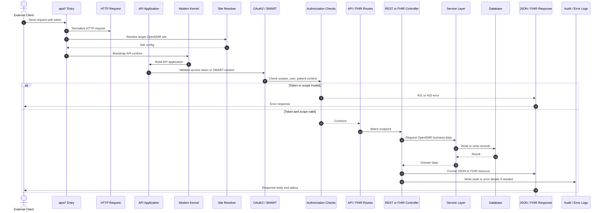

# OpenEMR Visual Architecture Guide

Audience: novice software engineers who need a clear mental model of how OpenEMR works before reading code.

Scope: this document is based on the local `openemr` codebase and focuses on clarity over exhaustive detail. OpenEMR is a large PHP application with a long-lived legacy layer and newer service/API code living beside it.

## Polished Overview Image

The generated slide-friendly overview image is stored here:

## 1. High-Level System Architecture Overview

This C4-style context/container view shows OpenEMR as one application made of several user-facing entry points. Most requests eventually use shared PHP services, database tables, files under site storage, and optional external healthcare systems.

```mermaid
%% OpenEMR high-level architecture overview
flowchart TB
    %% People and systems outside OpenEMR
    Clinician["Clinician / Staff"]
    Patient["Patient"]
    ExtApp["External Apps<br/>FHIR / SMART / REST clients"]

    %% OpenEMR boundary
    subgraph OpenEMR["OpenEMR Application"]
        direction TB

        subgraph Entry["Entry Points"]
            WebEntrypoints["Web UI entry points<br/>index.php, interface/*"]
            Portal["Patient Portal<br/>portal/*"]
            ApiLayer["API entry points<br/>apis/*"]
            OAuth["OAuth2 / SMART auth<br/>oauth2/*"]
        end

        subgraph AppCore["Application Core"]
            LegacyUI["Legacy clinical UI<br/>interface/* pages"]
            Services["Modern PHP services<br/>src/Services, src/Common"]
            Modules["Module systems<br/>custom modules + Laminas modules"]
            SharedLib["Shared legacy libraries<br/>library/*"]
            Templates["Templates and assets<br/>templates, public, assets"]
            Config["Configuration and globals<br/>sites, globals, OEGlobalsBag"]
        end
    end

    %% Data owned by OpenEMR
    subgraph Data["OpenEMR Data"]
        DB[("MySQL / MariaDB<br/>clinical, billing, auth, config data")]
        Files[("Site files<br/>documents, logs, patient uploads")]
        Cache[("Cache / generated assets<br/>temporary runtime data")]
    end

    %% External integrations
    subgraph External["External Systems"]
        Clearinghouse["Claims clearinghouse<br/>X12 / billing exchange"]
        Labs["Labs and clinical feeds<br/>HL7 / documents"]
        FHIRClients["FHIR servers or clients"]
        Payment["Payment processors"]
        Messaging["Email / SMS / fax systems"]
        Terminology["Terminology and code sets"]
    end

    Clinician -->|"Uses browser"| WebEntrypoints
    Patient -->|"Uses browser"| Portal
    ExtApp -->|"REST, FHIR, SMART"| ApiLayer
    ExtApp -->|"OAuth2 tokens"| OAuth

    WebEntrypoints --> LegacyUI
    Portal --> Services
    ApiLayer --> Services
    OAuth --> Services

    LegacyUI --> Services
    LegacyUI --> SharedLib
    Services --> SharedLib
    Modules --> Services
    Modules --> LegacyUI
    Config --> LegacyUI
    Config --> Services
    Templates --> LegacyUI

    Services --> DB
    SharedLib --> DB
    Services --> Files
    LegacyUI --> Files
    Services --> Cache

    Services --> Clearinghouse
    Services --> Labs
    Services --> FHIRClients
    Services --> Payment
    Services --> Messaging
    Services --> Terminology

    classDef person fill:#f7f1d5,stroke:#9a7b22,color:#222;
    classDef openemr fill:#e8f1ff,stroke:#2b5aa8,color:#111;
    classDef data fill:#e7f6ea,stroke:#2e7d32,color:#111;
    classDef external fill:#f6e8ff,stroke:#7b3fa1,color:#111;

    class Clinician,Patient,ExtApp person;
    class WebEntrypoints,Portal,ApiLayer,OAuth,LegacyUI,Services,Modules,SharedLib,Templates,Config openemr;
    class DB,Files,Cache data;
    class Clearinghouse,Labs,FHIRClients,Payment,Messaging,Terminology external;
```

## 2. Component / Module Breakdown

This view zooms inside the OpenEMR application. The important idea is that OpenEMR has both legacy page-based PHP screens and newer service/API objects. Future updates often need to understand both paths.

## 3. Data Flow and Key Processes

This diagram shows the common path for a request: choose the site, bootstrap configuration, authenticate if needed, route to either legacy UI or API code, use services/libraries, then write data and return a response.

## 4. Core Object and Dependency Relationships

OpenEMR is not purely object-oriented; it mixes procedural PHP pages, shared functions, and newer classes. This class-style diagram highlights the objects and dependencies that future code changes often touch.

## 5. Sequence Diagram: Staff Opens a Patient Chart

This is one of the most important end-to-end flows: a staff user logs in, enters the main UI, opens a patient chart, and OpenEMR loads patient data from services, legacy helpers, modules, templates, and the database.

## 6. Sequence Diagram: API / FHIR Request

This second sequence shows how an external application talks to OpenEMR. API requests rely more heavily on newer routing, authorization, services, and JSON/FHIR responses than the older staff UI pages do.

## How To Read These Diagrams

1. Start with the high-level overview. It tells you who uses OpenEMR and which big pieces exist.
2. Move to the component breakdown. This explains where code lives and why both `interface/*` and `src/*` matter.
3. Use the data flow diagram when tracing a bug. Find the request type, then follow arrows toward services, database, files, and response rendering.
4. Use the object/dependency diagram to identify likely code owners. For example, API changes often touch controllers plus services; legacy UI changes often touch `interface/*`, `library/*`, and services together.
5. Use sequence diagrams when you need the order of operations. They show timing: bootstrap first, auth next, routing/controllers after that, then data access and response.

## Additional Views Worth Creating Later

1. Entity relationship diagram for core clinical tables: patient, encounter, form, document, billing, users, roles, and audit data.
2. Module extension lifecycle diagram: how custom modules are discovered, enabled, hooked into events, rendered in UI, and upgraded.
3. FHIR and SMART security diagram: token creation, scopes, patient context, authorization enforcement, and FHIR resource mapping.

