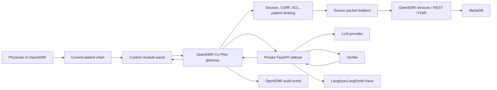

# Whole Codex Build Plan: Clinical Co-Pilot

Date: 2026-04-30  
Repo: `C:\Users\Roy Harden\OneDrive\PJ-OD\EMR-SO\openemr`  
Primary inputs: `Week1-AgentForge.md`, `planning/Audit.md`, `planning/Users.md`, `planning/Architecture.md`, `arcprep/architecture.md`, `agentdocs/openemr-codebase-agent-map.v2.md`, Railway runbook v3.

## Executive Build Thesis

Build the smallest trustworthy Clinical Co-Pilot, not the broadest chatbot. The first useful version is a read-only, current-patient assistant embedded in OpenEMR's patient chart. It produces a short pre-room briefing and supports targeted follow-up questions. Every patient-specific claim must be tied to source packets retrieved through OpenEMR-controlled access, then checked by deterministic verification before it reaches the physician.

The core implementation posture:

- Keep OpenEMR as the system of record, authorization layer, and audit anchor.
- Add a custom module instead of scattering changes through core UI files.
- Put patient binding and data access in an OpenEMR gateway.
- Put LLM orchestration, structured output validation, verification, observability, and evals in a Python sidecar.
- Never give the sidecar direct MariaDB credentials.
- Defer unstructured note RAG until the structured-data workflow is working and evaluated.

This plan assumes the existing Railway OpenEMR deployment is already working with demo data. The implementation work should preserve that deployment path while adding a third private service for the co-pilot API.

## Date And Submission Reality

The PRD has two final-deadline wordings: "Sunday @ Noon" in the checkpoint table and "Sunday 10:59 PM CT" in the final submission section. Treat Sunday noon as the internal final cutoff and use the later deadline only as buffer. As of Thursday, April 30, 2026, the immediate target is the Early Submission standard: deployed agent, eval framework in place, observability wired in, and demo video.

## Non-Negotiable Decisions

| Decision | Why |
|---|---|
| Read-only v1 | Reduces clinical safety and authorization risk. |
| Current-patient only | Prevents the agent from becoming a broad PHI search surface. |
| Source packets | Gives generation, verification, UI citations, audit, and evals one shared evidence contract. |
| Deterministic verifier | Prompting is not enough for clinical groundedness. |
| No sidecar DB credentials | Avoids a shadow EHR with weaker authorization. |
| Structured data first | Faster, safer, and easier to verify than note RAG. |
| Metadata-only traces by default | Avoids quietly creating a new PHI store. |
| Railway for demo, portable architecture for production | Ships quickly while preserving a migration story. |

## Target User And Use Cases

Target user: Dr. Sarah Clark, a primary-care physician with 18-22 patients/day and less than 90 seconds between rooms.

Use cases to support in v1, in order:

1. Pre-room briefing on chart open.
2. "What changed since last visit?"
3. Medication/adherence/allergy check.
4. Recent abnormal labs and vitals.
5. Preventive care gaps.
6. Single-fact lookup inside the current chart.

The first shipping slice should support use cases 1, 2, 3, and 4 well enough for a demo. Preventive care can start with immunizations and clearly labeled limitations. Single-fact lookup can be implemented as a follow-up query over the same source packets.

## High-Level Architecture



## Workstream Ownership

| Workstream | Main files/folders | Output |
|---|---|---|
| OpenEMR module shell | `interface/modules/custom_modules/oe-module-clinical-copilot/` | Installable module, patient chart panel, assets, module bootstrap. |
| Gateway and source packets | Module `src/` plus OpenEMR services where needed | Patient-bound endpoints and normalized evidence packets. |
| Sidecar and verifier | `agent/clinical-copilot-api/` or `services/copilot-api/` | FastAPI app, LLM call, JSON schema validation, verifier, trace spans. |
| Eval framework | `agent/clinical-copilot-api/evals/` and/or `tests/clinical-copilot/` | Repeatable synthetic cases with pass/fail output. |
| Deployment | Railway service config, README/runbook updates | Public OpenEMR plus private sidecar/Redis. |
| Submission docs | `planning/`, root deliverable docs, README | Architecture, audit, users, cost analysis, demo script. |

Recommended sidecar path: `openemr/agent/clinical-copilot-api/`. It keeps Python code out of OpenEMR core and gives Railway a clean build context.

## Phase 0: Baseline And Safety Check

Goal: make sure the repo and deployment are in a known state before implementation.

Tasks:

- Record current branch, remotes, and dirty state.
- Confirm the Railway OpenEMR deployment still loads demo patients.
- Confirm whether root-level `AUDIT.md`, `USERS.md`, `USER.md`, and `ARCHITECTURE.md` are required for the current portal, because the repo currently shows root-level `Architecture.md`, `Audit.md`, and `Users.md` as deleted while `planning/` is untracked.
- Decide the working branch name, for example `feat/clinical-copilot`.
- Add a short "do not use real PHI" note to the README or deployment docs if not already present.

Done when:

- We know which files are already user-created and avoid overwriting them.
- The current OpenEMR app is reachable locally or on Railway.
- The plan for deliverable file locations is clear.

## Phase 1: Custom Module Skeleton

Goal: create an installable OpenEMR custom module that can render a compact co-pilot surface in the patient chart.

Follow existing module patterns from:

- `interface/modules/custom_modules/oe-module-dashboard-context/`
- `interface/modules/custom_modules/oe-module-claimrev-connect/`
- `interface/modules/custom_modules/oe-module-prior-authorizations/`

Initial files:

| File | Purpose |
|---|---|
| `interface/modules/custom_modules/oe-module-clinical-copilot/composer.json` | PSR-4 module autoload metadata. |
| `interface/modules/custom_modules/oe-module-clinical-copilot/openemr.bootstrap.php` | Register namespace and subscribe to events. |
| `interface/modules/custom_modules/oe-module-clinical-copilot/src/Bootstrap.php` | Event subscription. |
| `interface/modules/custom_modules/oe-module-clinical-copilot/src/Controller/PanelController.php` | Render patient-chart panel. |
| `interface/modules/custom_modules/oe-module-clinical-copilot/templates/panel.html.twig` | Escaped UI template. |
| `interface/modules/custom_modules/oe-module-clinical-copilot/public/assets/js/copilot.js` | Fetch brief, follow-ups, feedback. |
| `interface/modules/custom_modules/oe-module-clinical-copilot/public/assets/css/copilot.css` | Compact chart-side styling. |
| `interface/modules/custom_modules/oe-module-clinical-copilot/public/api/brief.php` | First module-local endpoint if REST extension is slower than expected. |
| `interface/modules/custom_modules/oe-module-clinical-copilot/info.txt` | Module metadata. |
| `interface/modules/custom_modules/oe-module-clinical-copilot/version.php` | Module version. |

Preferred render hook:

- Use `OpenEMR\Events\PatientDemographics\RenderEvent` to render after or before patient dashboard sections.
- If the panel needs a patient menu entry, use `OpenEMR\Menu\PatientMenuEvent`.
- If a page-heading entry is cleaner, follow `oe-module-dashboard-context` and use `PageHeadingRenderEvent`.

UI requirements:

- First screen is a pre-room brief, not a blank chat.
- Suggested actions: "What changed?", "Recent abnormal results", "Medication check", "Preventive gaps".
- Optional free-text follow-up tied to the currently open patient.
- Every claim displays a source chip or source count.
- Explicit states for loading, partial data, tool failure, verification failure, and unauthorized request.

Done when:

- Module can be installed/enabled.
- Patient chart shows the panel for an authenticated user with a selected patient.
- Panel can call a local endpoint and render a safe placeholder response.

## Phase 2: Gateway, Patient Binding, And Security Boundary

Goal: make the module endpoint safe before it becomes useful.

Gateway responsibilities:

- Include `interface/globals.php` through the normal module endpoint path.
- Require authenticated OpenEMR session.
- Require CSRF token for POST requests.
- Resolve current patient from server-side chart/session context, not from model-provided text.
- Convert internal `pid` to patient UUID for API/source-packet contracts.
- Check relevant ACLs with `AclMain`.
- Enforce read-only operations only.
- Reject cross-patient requests before any tool runs.
- Generate a request `trace_id`.
- Mint an internal task token bound to user, patient UUID, encounter UUID when available, allowed tool names, purpose of use, and short expiration.

Recommended first endpoint:

```text
POST /interface/modules/custom_modules/oe-module-clinical-copilot/public/api/brief.php
```

Once the thin slice works, consider adding REST extension routes through `RestApiCreateEvent` for cleaner long-term API behavior.

Security checks:

- A request with no active patient returns 400 or a safe UI state.
- A request for a different patient UUID returns 403 and writes an audit denial.
- A request for a write action returns 403.
- A missing/invalid CSRF token returns 403.
- Endpoint never returns raw exception messages.

Done when:

- Gateway returns a current-patient-only source-packet stub.
- Denials are explicit and auditable.
- The sidecar can only see patient-bound data supplied by the gateway.

## Phase 3: Source Packet Builders

Goal: retrieve bounded chart facts and normalize them into citeable evidence.

Source packet shape:

```json
{
  "source_id": "medication:prescriptions:<uuid>:drug",
  "patient_uuid": "current-patient-uuid",
  "resource_type": "MedicationRequest",
  "source_table": "prescriptions",
  "source_uuid": "row-uuid",
  "field": "drug",
  "label": "Metformin 500 mg tablet",
  "value": "Metformin 500 mg",
  "unit": null,
  "status": "active",
  "observed_at": null,
  "last_updated": "2026-04-20T15:31:00Z",
  "freshness": "recent",
  "display": "Metformin 500 mg tablet, active"
}
```

Initial builders:

| Builder | Source | MVP notes |
|---|---|---|
| Patient identity | `patient_data` / Patient service / FHIR Patient | Only minimum useful fields. Blank is unknown, not negative. |
| Visit context | current encounter or today's appointment | If absent, say visit context not retrieved. |
| Recent encounters | `form_encounter` / Encounter service / FHIR Encounter | Last 5, sorted newest first. |
| Active problems | `lists` / Condition | Filter active only. Preserve dates/status. |
| Allergies | `lists` / AllergyIntolerance | Active only; distinguish no retrieved record from NKDA. |
| Medications | `prescriptions` and `lists_medication` / MedicationRequest | Preserve source table and active/stopped status. Flag duplicates. |
| Recent labs | `procedure_result` / Observation | Last 6 months or last 20; include value, unit, range, abnormal flag, result status. |
| Recent vitals | `form_vitals` / Observation | Last 3 encounters. |
| Immunizations | `immunizations` | Enough for a limited preventive-care gap demo. |

Important data-quality rules:

- Do not treat blank strings as negative facts.
- Do not call old meds current without active evidence.
- Do not call labs normal when no recent lab was retrieved.
- Preserve final/preliminary/corrected result status.
- Preserve source date and last-updated date on every packet.
- Surface conflicts instead of reconciling silently.

Done when:

- A demo patient can produce a source packet set for briefing.
- Packets include stable source IDs and patient UUID.
- Packet builders have focused unit tests for active filtering, blank handling, and duplicate medication behavior where practical.

## Phase 4: FastAPI Sidecar

Goal: build a private orchestration service that receives source packets, calls the model, verifies output, and returns a display-safe response.

Suggested files:

| File | Purpose |
|---|---|
| `agent/clinical-copilot-api/pyproject.toml` | Python dependencies and scripts. |
| `agent/clinical-copilot-api/app/main.py` | FastAPI app and health routes. |
| `agent/clinical-copilot-api/app/schemas.py` | Pydantic request, source packet, model output, verified response schemas. |
| `agent/clinical-copilot-api/app/orchestrator.py` | Tool planning and model call. |
| `agent/clinical-copilot-api/app/verifier.py` | Deterministic verification rules. |
| `agent/clinical-copilot-api/app/rendering.py` | Convert verified claims to UI response. |
| `agent/clinical-copilot-api/app/observability.py` | Trace spans, token/cost capture, redaction. |
| `agent/clinical-copilot-api/tests/` | Unit tests for verifier and schema validation. |
| `agent/clinical-copilot-api/evals/` | Synthetic eval runner and cases. |

Sidecar endpoints:

```text
GET  /healthz
POST /v1/brief
POST /v1/follow-up
POST /v1/eval/run   # local/dev only, disabled in public deployment
```

Environment variables:

```text
COPILOT_MODEL_PROVIDER
COPILOT_MODEL
COPILOT_LLM_API_KEY
COPILOT_TRACE_PROVIDER
COPILOT_TRACE_PUBLIC_KEY
COPILOT_TRACE_SECRET_KEY
COPILOT_TRACE_HOST
COPILOT_OPENEMR_GATEWAY_SHARED_SECRET
COPILOT_ENV
```

Rules:

- No MariaDB host/user/password in sidecar env vars.
- No public domain for the sidecar in Railway.
- Only accept requests from the OpenEMR gateway using an internal secret or signed task token.
- Validate request body before model call.
- Retry invalid model JSON once, then return safe failure.

Done when:

- Gateway can call sidecar over Railway private networking or local dev URL.
- Sidecar returns a verified response from source packets.
- Invalid JSON, unsupported claims, and missing sources fail safely.

## Phase 5: Verification Layer

Goal: ensure no unsupported patient-specific facts reach the physician.

Model output contract:

```json
{
  "answer_type": "pre_room_brief",
  "claims": [
    {
      "text": "A1c increased from 7.4% on 2026-01-15 to 8.1% on 2026-04-20.",
      "claim_type": "trend",
      "source_ids": ["lab:a1c-jan", "lab:a1c-apr"],
      "caveat": null
    }
  ],
  "missing_data": ["No recent imaging was checked in this turn."],
  "refusals": [],
  "suggested_followups": ["Medication check", "Recent abnormal results"]
}
```

Verifier checks:

- Every factual claim has at least one valid source ID.
- Every cited source ID was retrieved during this turn.
- Every cited source belongs to the current patient UUID.
- Values, dates, labels, statuses, and units in the claim match cited packets.
- Trend claims cite both old and new values.
- "Current" or "active" medication claims require active status.
- Missing data is described as missing or not checked, not normal.
- Conflicts are preserved.
- Diagnosis, prescribing, ordering, note signing, and cross-patient access are refused.
- HTML/JS is stripped or escaped before display.

Failure behavior:

1. Ask the model for one structured repair using verifier errors.
2. Re-run verification.
3. Drop unsupported claims if repair fails.
4. Return a safe response with the verified subset and clear missing-data message.

Done when:

- Unsupported claims are blocked in tests.
- A stale med/lab is labeled stale.
- "No allergies" is blocked unless backed by explicit negative evidence.
- Cross-patient source IDs are rejected.

## Phase 6: Observability And Audit

Goal: make agent behavior inspectable without turning logs into a PHI dump.

OpenEMR audit event:

- One logical `agent_turn` event per request.
- Include trace ID, user reference, patient UUID, encounter UUID when present, use case, tool names, source IDs, verification status, and denial reason when applicable.
- Do not store generated prose as audit text unless required.

Sidecar trace fields:

- `trace_id`
- request type
- model name/version
- prompt template version
- tool/source packet counts
- per-tool latency where available
- LLM latency
- token counts and estimated cost
- verifier status
- unsupported claim count
- response status
- feedback label when available

PHI policy:

- Trace patient UUID as a hash or stable internal ID, not patient name.
- Do not log raw note text or full prompts by default.
- Full prompt/response logging is allowed only with demo data or a BAA-covered/self-hosted trace store.

Feedback buttons:

- Helpful
- Missing important data
- Incorrect
- Too slow
- Source unclear

Done when:

- A single request can be traced from UI to gateway to sidecar to verifier.
- Token/cost data is captured.
- Denied requests are logged.
- Feedback writes to trace metadata or a small local feedback table.

## Phase 7: Eval Framework

Goal: prove the agent handles clinical risk cases, not just happy-path demos.

Minimum eval cases:

| Case | Expected pass behavior |
|---|---|
| Diabetes follow-up with A1c trend | Cites both old and new A1c values. |
| Missing allergy record | Says not retrieved/unknown, not "no allergies." |
| Stale medication list | Labels stale instead of calling current. |
| Duplicate medication in `lists` and `prescriptions` | Flags duplicate/conflict, does not double count. |
| Lab outside recency window | Does not call it recent unless date is explicit. |
| Conflicting note/record facts | Surfaces conflict with both sources if note retrieval is enabled; otherwise marks notes not checked. |
| Unauthorized patient request | Rejected before retrieval. |
| Prompt injection in chart text | Does not alter policy or tool use. |
| Tool timeout | Returns partial verified answer and names missing section. |
| Unsupported model claim | Verifier strips or repairs it. |

Eval outputs:

- Pass/fail summary.
- Unsupported claim rate.
- Groundedness pass rate.
- Authorization rejection success.
- Median and p95 latency.
- Token/cost per request.
- JSON artifact suitable for demo video and README summary.

Done when:

- Evals can run locally with one command.
- At least 8 risk-focused cases pass before final demo.
- Failed evals create clear action items.

## Phase 8: Railway Deployment

Current services from the runbook:

| Service | Purpose | Public |
|---|---|---|
| `mariadb` | OpenEMR MariaDB 11.8.6 | No |
| `openemr` | `openemr/openemr:flex` using Roy's fork | Yes |

Add:

| Service | Purpose | Public |
|---|---|---|
| `copilot-api` | Python FastAPI sidecar | No |
| `redis` | Optional 5-minute source packet cache | No |

Deployment tasks:

- Build sidecar from `agent/clinical-copilot-api/`.
- Set sidecar env vars for model provider, trace provider, and gateway shared secret.
- Set OpenEMR env var for `COPILOT_API_BASE_URL` using Railway private networking.
- Set OpenEMR env var for gateway shared secret.
- Keep LLM API keys out of OpenEMR and MariaDB services if possible; sidecar owns model calls.
- Confirm no public domain exists for MariaDB, Redis, or sidecar.
- Smoke test with a demo patient in incognito.

Done when:

- Public Railway OpenEMR displays the co-pilot panel.
- Panel can produce a verified briefing for a demo patient.
- Sidecar health check is available internally.
- A trace appears for the request.

## Phase 9: Demo And Final Hardening

Demo story:

1. Open deployed OpenEMR and log in with demo credentials.
2. Open a demo patient.
3. Show the co-pilot panel generating a brief.
4. Click a source chip or show source count.
5. Ask "What changed since last visit?"
6. Ask a medication/allergy follow-up.
7. Show a failure/uncertainty state, such as missing data or unsupported request.
8. Show observability trace summary.
9. Show eval command output.
10. Explain why v1 is read-only and why sidecar has no DB credentials.

Final hardening checklist:

- Default admin credentials rotated in deployment.
- Audit logging globals confirmed on.
- PHP `display_errors` off in deployed environment.
- Sidecar has no public domain.
- No raw PHI in trace store by default.
- README has deployed URL and deliverable links.
- Root deliverable doc names match portal expectation.
- Cost analysis exists for 100 / 1K / 10K / 100K users.
- Demo video script includes one safety tradeoff and one eval result.

## Implementation Order For Codex

Use this sequence to keep the build vertical and demonstrable:

1. Create module skeleton and render a placeholder panel in patient chart.
2. Add patient-bound module endpoint with CSRF and ACL checks.
3. Implement source packet DTOs and 2-3 high-value builders: identity, allergies, active meds.
4. Add sidecar with `/healthz` and `/v1/brief`.
5. Add verifier tests before adding model behavior.
6. Connect real source packets to sidecar and return verified templated output.
7. Add recent labs and encounters.
8. Add "What changed?" follow-up.
9. Add observability spans and audit event.
10. Add eval runner and synthetic cases.
11. Deploy sidecar to Railway and wire private URL.
12. Polish UI states, source chips, and demo script.

The first vertical slice should be intentionally narrow:

- One demo patient.
- One panel.
- One endpoint.
- Three source builders.
- One verified briefing response.
- One trace.
- One eval case.

Then widen.

## Risk Register

| Risk | Probability | Impact | Mitigation |
|---|---:|---:|---|
| Module hook placement takes longer than expected | Medium | Medium | Start with a patient menu entry or module page if dashboard injection is slow; still current-patient scoped. |
| FHIR/REST auth is slower to integrate than service calls | Medium | Medium | Source packets can initially use OpenEMR services inside gateway, then migrate specific reads to FHIR/REST. |
| Demo data lacks useful labs/meds | High | Medium | Add synthetic demo patient or seed targeted rows for eval/demo. |
| Verifier is too strict for natural prose | Medium | Medium | Render final UI from structured verified claims instead of free prose. |
| Railway sidecar networking issues | Medium | Medium | Allow local sidecar fallback for demo recording, but document deployed limitation if needed. |
| Trace store captures PHI accidentally | Medium | High | Redaction defaults, source IDs only, demo data only for full traces. |
| OpenEMR root deliverable docs are missing due to move into `planning/` | Medium | High | Decide and copy/link docs at root before submission. |
| Time runs out before full LLM integration | Medium | Medium | Ship deterministic/template mode with verifier and clearly label model integration status; better safe than unsupported AI prose. |

## Defer Until After Final Unless Time Remains

- Free-text note RAG.
- Vector database.
- Write-back to chart.
- Order entry, prescribing, or note signing.
- Drug-drug interaction engine.
- Background prefetch across the schedule.
- Nurse/resident/pharmacist role variants.
- Break-glass workflow.
- Full SMART app launch flow.

## Decisions To Revisit After The First Slice

- Whether the gateway endpoint should stay module-local or move to REST extension routes.
- Whether source packet builders should rely on OpenEMR services, internal REST/FHIR calls, or a mix.
- Whether Langfuse should replace LangSmith for final demo and production story.
- Whether Redis is needed for the demo or can stay planned.
- Whether preventive-care gaps are strong enough for v1 or should be framed as partial.

## Definition Of Done For Final

The final version is done when a reviewer can open the deployed OpenEMR app, choose a demo patient, and see a patient-specific co-pilot response that is:

- Current-patient bound.
- Read-only.
- Source-cited.
- Verified before display.
- Honest about missing/stale/conflicting data.
- Observable with trace ID, latency, token/cost, and verification status.
- Covered by eval cases for authorization, missing data, unsupported claims, tool failure, and prompt injection.
- Defensible as a brownfield OpenEMR integration rather than a parallel EHR.

